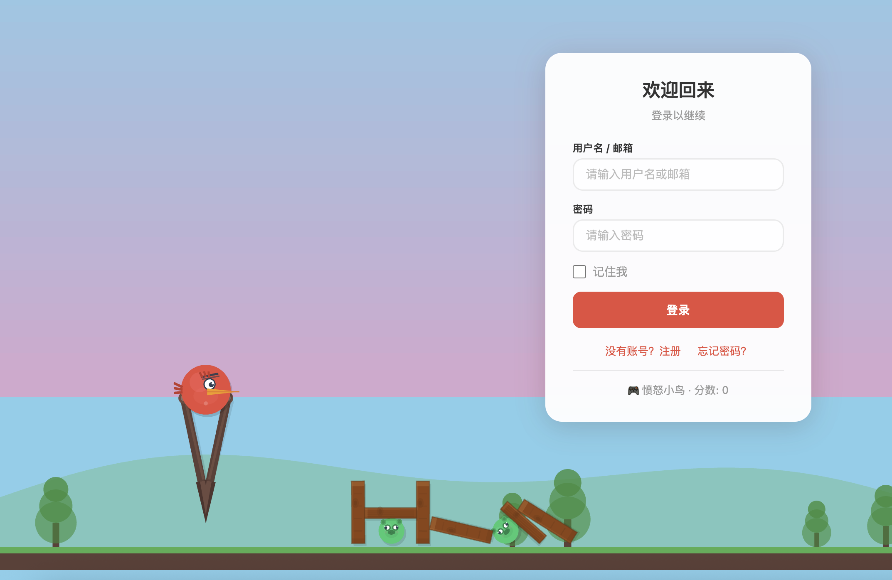

# SpringBoot-Vue-Template-Jwt

基于 **Spring Boot 4 + JWT + MyBatis-Plus** 的全栈项目模板，集成了用户认证系统与交互式前端。

## 🏗 项目结构

```
SpringBoot-Vue-Template-Jwt/
├── spring-boot-full-stack/    # 🖥 主后端 —— Spring Boot 4 认证服务
├── pixijs-full-stack/         # 🎮 主前端 —— 登录页 + 愤怒小鸟游戏
├── my-project-backend/        # 🗄 旧版后端 —— Spring Boot 3 参考实现
├── database.sql               # 📦 MySQL 数据库初始化脚本
└── README.md
```

---

## 🖥 后端 —— `spring-boot-full-stack`

### 技术栈

| 依赖 | 版本 | 用途 |
|------|------|------|
| Spring Boot | 4.1.0 | 框架基础 |
| Java | 17 | 运行环境 |
| Spring Security | 6.x | 认证与授权 |
| MyBatis-Plus | 3.5.16 | ORM |
| java-jwt | 4.3.0 | JWT 令牌 |
| Redis | - | JWT 黑名单 / 验证码 / 限流 |
| RabbitMQ | - | 异步邮件发送 |
| MySQL | 8.0+ | 数据库 |
| SpringDoc OpenAPI | 2.1.0 | Swagger 文档 |

### API 接口

| 方法 | 路径 | 说明 | 需认证 |
|------|------|------|--------|
| `POST` | `/api/auth/login` | 登录（form-urlencoded） | ❌ |
| `GET` | `/api/auth/logout` | 退出登录 | ✅ |
| `POST` | `/api/auth/register` | 邮箱注册 | ❌ |
| `GET` | `/api/auth/ask-code` | 请求邮件验证码 | ❌ |
| `POST` | `/api/auth/reset-confirm` | 重置密码 - 验证 | ❌ |
| `POST` | `/api/auth/reset-password` | 重置密码 - 执行 | ❌ |

**响应格式：**
```json
{ "id": 123456, "code": 200, "data": {...}, "message": "请求成功" }
```

**登录成功返回：**
```json
{ "username": "admin", "role": "user", "token": "eyJ...", "expire": "2026-06-28T..." }
```

### 启动后端

```bash
# 前置依赖
# 1. MySQL 8.0+（创建数据库 test 并执行 database.sql）
# 2. Redis 6.0+
# 3. RabbitMQ（可选，用于邮件发送）
# 4. Mailpit（可选，本地邮件调试）

cd spring-boot-full-stack

# 开发模式启动
mvn spring-boot:run -P dev

# Swagger 文档
# http://localhost:8080/swagger-ui/index.html
```

### 配置文件

| 文件 | 用途 |
|------|------|
| `application.yaml` | 主配置，激活 profile |
| `application-dev.yaml` | 开发环境（本地 MySQL/Redis/Mailpit） |
| `application-prod.yaml` | 生产环境（需修改数据库/邮件等配置） |

### 认证流程

```
POST /api/auth/login (username + password)
  → UsernamePasswordAuthenticationFilter 验证
  → onAuthSuccess() 生成 JWT
  → 返回 { token, expire, username, role }

后续请求 Authorization: Bearer <token>
  → JwtAuthorizeFilter 解析令牌
  → 设置 SecurityContext
  → 放行到 Controller
```

---

## 🎮 主前端 —— `pixijs-full-stack`

### 技术栈

| 依赖 | 版本 | 用途 |
|------|------|------|
| Vue 3 | 3.5.x | 前端框架 |
| Vite | 8.x | 构建工具 |
| PixiJS | 8.19.x | 图形渲染引擎 |
| matter-js | 0.20.x | 物理引擎 |
| Vue Router | 5.x | 路由 |
| Axios | 1.x | HTTP 请求 |

### 功能特性

- **登录 / 注册 / 重置密码**：三合一页面切换，无需路由跳转
- **愤怒小鸟游戏**：在登录页面即可游玩
  - 拖拽弹弓发射小鸟
  - matter.js 物理引擎（重力、碰撞、连锁反应）
  - 2 个关卡（木头 / 石头 / 玻璃材质）
  - 抛物线轨迹预览
  - 碰撞粒子特效
  - Web Audio API 程序化音效
- **物理登录框**：登录框是 matter.js 物理墙，小鸟撞到会真实反弹
- **Vite 代理**：`/api` → `http://localhost:8080`

### 页面一览

| 路径 | 内容 |
|------|------|
| `/` | 登录页（PixiJS 全屏画布 + 愤怒小鸟游戏 + 登录表单） |
| `/index` | 主页（登录成功后显示用户信息） |

注册和重置密码通过页面内切换实现，无需路由跳转，游戏状态不中断。

### 启动前端

```bash
cd pixijs-full-stack

# 安装依赖
pnpm install

# 开发模式启动（默认 http://localhost:5173）
pnpm dev

# 构建
pnpm build
```

### 游戏操作

1. 在游戏区域点击弹弓上的小鸟
2. 向后（左）拖拽，松手发射
3. 小鸟飞出抛物线轨迹，撞击建筑
4. 击倒所有绿色猪怪即可过关 🐷

> **注意**：游戏交互区域为屏幕左侧 70%，右侧 30% 为登录表单区域。

---

## 🗄 旧版后端 —— `my-project-backend`

Spring Boot 3.x 版本的认证服务参考实现，与新后端功能一致，可作为迁移参考。

---


## 🚀 快速体验

### 1. 初始化数据库

```bash
# 创建 MySQL 数据库并导入表结构
mysql -u root -p test < database.sql

# 插入测试用户（密码需 BCrypt 加密）
# 或注册一个新账号
```

### 2. 启动后端服务

```bash
cd spring-boot-full-stack
mvn spring-boot:run -P dev
# → http://localhost:8080
```

### 3. 启动前端

```bash
cd pixijs-full-stack
pnpm dev
# → http://localhost:5173（自动代理 /api 到 8080）
```

### 4. 打开浏览器

访问 `http://localhost:5173/`，开始玩耍吧！🎯

---

## ⚙ 环境要求

| 工具 | 版本要求 |
|------|----------|
| Java | 17+ |
| Node.js | 20.19+ 或 22.12+ |
| pnpm | 8+ |
| MySQL | 8.0+ |
| Redis | 6.0+ |
| RabbitMQ | 可选（用于邮件） |

---

## 📜 数据库表结构

```sql
CREATE TABLE `db_account` (
  `id`            INT           NOT NULL AUTO_INCREMENT,
  `username`      VARCHAR(255)  DEFAULT NULL,
  `email`         VARCHAR(255)  DEFAULT NULL,
  `password`      VARCHAR(255)  DEFAULT NULL,  -- BCrypt 加密
  `role`          VARCHAR(255)  DEFAULT NULL,  -- 默认 "user"
  `register_time` DATETIME      DEFAULT NULL,
  PRIMARY KEY (`id`),
  UNIQUE KEY `unique_email`    (`email`),
  UNIQUE KEY `unique_username` (`username`)
) ENGINE=InnoDB DEFAULT CHARSET=utf8mb4;
```

---

## 📸 截图


> 启动后登录页效果：全屏 PixiJS 渲染的风景背景 + 愤怒小鸟游戏 + 玻璃态表单卡片。
> 
> <p align="center">
>   <i>左 70% 为游戏区，右 30% 为登录表单</i>
> </p>

---

## 📄 许可证

MIT License
